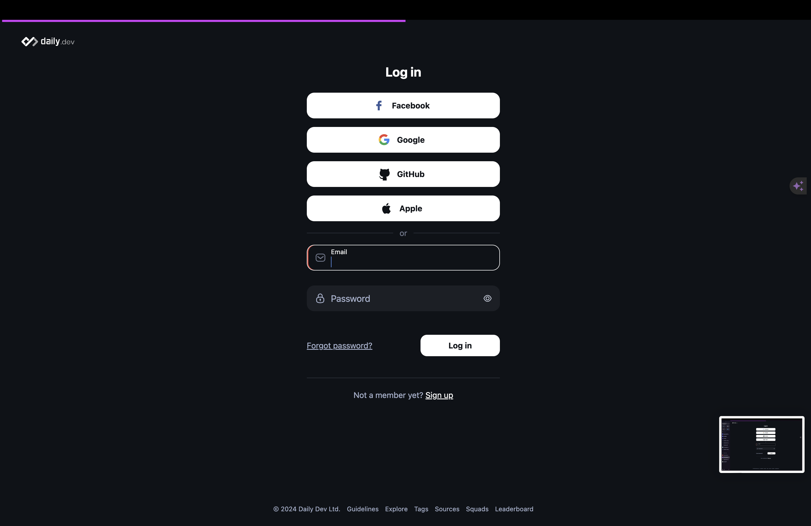
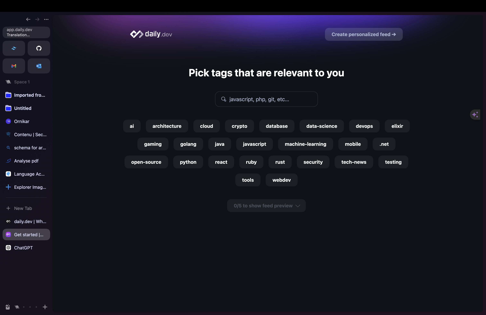
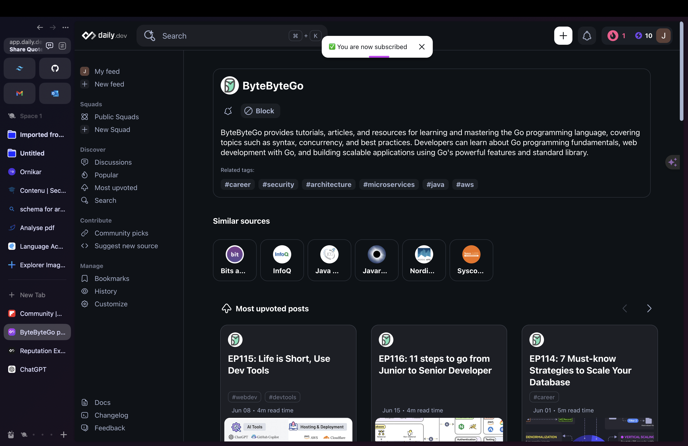
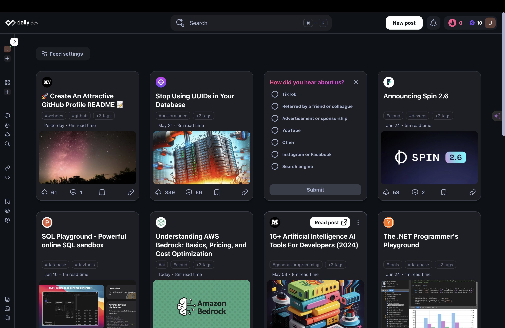

# Guide d'Utilisation de Daily Dev pour la Veille Informationnelle

## Voici un guide d'utilisation pour effectuer de la veille informationnelle à l'aide du site Daily Dev :

### 1. Créez un compte : 
Pour commencer, vous devez créer un compte sur Daily Dev si vous n'en avez pas déjà un. Cela vous permettra d'accéder à toutes les fonctionnalités du site. Il vous sera offert 10 point de réputation.
      

### 2. Paramétrer vos préférences : 
Une fois que vous avez créé votre compte, vous pouvez paramétrer vos préférences pour
recevoir des informations spécifiques à votre domaine d'intérêt.
      

### 3. Suivez les sujets qui vous intéressent : 
En haut de la page d'accueil, vous trouverez une barre de recherche. Utilisez-la pour rechercher et suivre les sujets qui vous intéressent.
      

### 4. Consultez votre fil d'actualités :

Chaque jour, consultez votre fil d'actualités sur Daily Dev pour voir les dernières informations sur les sujets que vous suivez. Vous pouvez lire les articles directement sur le site ou cliquer sur les liens pour accéder aux sources originales.
      

### Conclusion
En suivant ces étapes, vous pourrez efficacement utiliser Daily Dev pour effectuer une veille informationnelle sur un sujet précis. Restez actif, engagez-vous avec la communauté, et continuez à découvrir et partager des connaissances.

## Récapitulatif des Actions Clés
1. Créez et optimisez votre compte Daily Dev.
2. Paramétrez vos préférences.
3. Suivez les sujets qui vous intéressent.
4. Consultez régulièrement votre fil d'actualités.

En intégrant ces pratiques dans votre routine, vous serez toujours à jour sur les dernières évolutions et tendances de votre domaine d'intérêt sur Daily Dev.

---