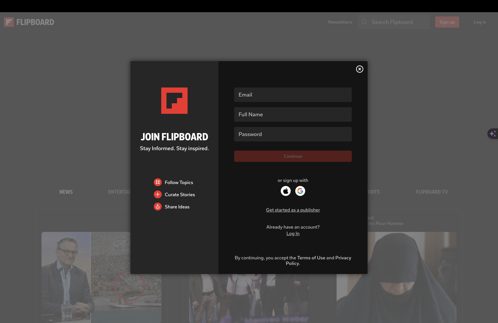
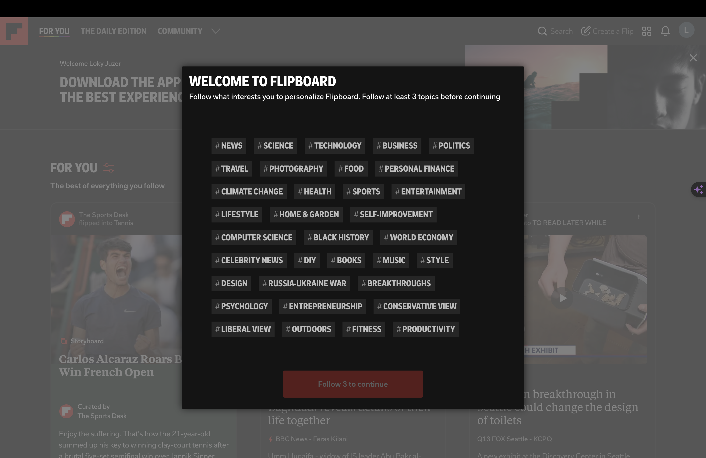
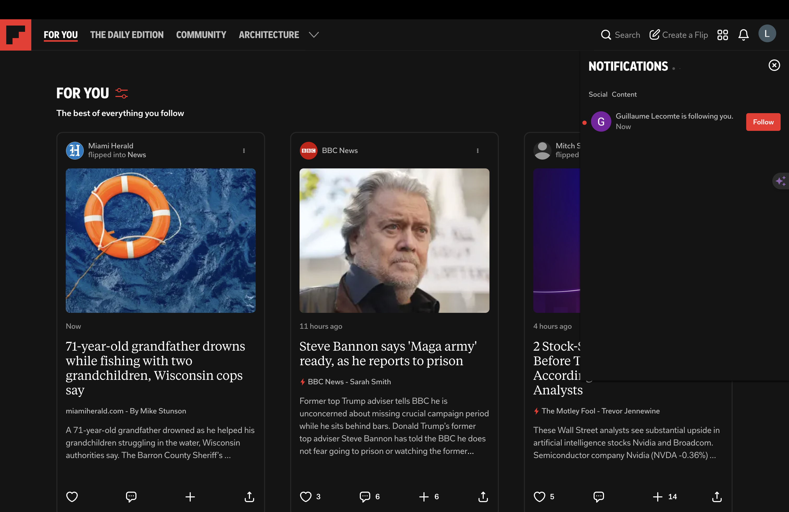

# Guide de Veille Technologique avec Flipboard

## Introduction

Flipboard est une plateforme idéale pour effectuer de la veille technologique grâce à sa capacité à agréger du contenu pertinent à partir de différentes sources. Ce guide vous explique comment utiliser Flipboard pour rester informé des dernières informations, tendances et innovations sur un sujet précis.

## Étapes pour la Veille Technologique

### 1. **Créer et Optimiser votre Compte Flipboard**

Pour commencer, créez un compte Flipboard et configurez-le pour maximiser votre expérience de veille.

- **Créer un Compte :** Inscrivez-vous sur Flipboard en utilisant votre adresse email ou vos comptes de réseaux sociaux.
    
  
    
- **Personnaliser votre Profil :** Ajoutez une photo de profil et une courte biographie décrivant votre intérêt pour le sujet défini et les domaines associés.

  

### 2. **Suivre des Magazines et des Sources Pertinentes**

Flipboard permet de suivre des magazines et des sources spécifiques pour accéder à du contenu pertinent.

- **Recherche de Magazines :** Utilisez la barre de recherche pour trouver des magazines consacrés au sujet défini et aux domaines connexes.
- **Suivre des Magazines :** Cliquez sur "Follow" pour suivre des magazines pertinents à votre sujet d'intérêt.
- **Ajouter des Sources :** Ajoutez des sources spécifiques à vos centres d'intérêt pour un flux d'informations personnalisé.

  

<!-- ### 3. **Créer Vos Propres Magazines**

Créer vos propres magazines vous permet de regrouper et organiser les articles que vous trouvez intéressants.

- **Créer un Magazine :** Allez dans votre profil et cliquez sur "Create a Magazine". Donnez un titre à votre magazine, par exemple "Veille Technologique".
- **Ajouter du Contenu :** Ajoutez des articles, des vidéos, et d'autres contenus relatifs au sujet défini à votre magazine en cliquant sur le bouton "+" sur les articles. -->

### 3. **Utiliser les Catégories et les Tags**

Les catégories et les tags sont des outils puissants pour affiner votre recherche et suivre les sujets spécifiques.

  

- **Recherche par Catégorie :** Parcourez les catégories comme "Technology", "Programming", et d'autres pertinentes pour trouver du contenu lié à votre sujet.
- **Utiliser des Tags :** Recherchez et suivez des tags spécifiques à votre sujet pour filtrer le contenu.

### 4. **Configurer des Alertes et Notifications**

Pour ne manquer aucune information importante, configurez des alertes et des notifications.

  

- **Configurer des Notifications :** Activez les notifications pour être alerté des nouveaux articles ajoutés aux magazines et aux tags que vous suivez.
- **Utiliser les Alertes Personnalisées :** Configurez des alertes personnalisées pour recevoir des mises à jour sur les sujets spécifiques.

<!-- ### 5. **Interagir avec la Communauté Flipboard**

Engagez-vous avec la communauté Flipboard pour enrichir votre veille technologique.

- **Commenter et Partager :** Laissez des commentaires sur les articles intéressants et partagez-les avec votre réseau.
- **Participer aux Discussions :** Engagez-vous dans les discussions sur les articles pour partager vos idées et apprendre des autres utilisateurs. -->

### 5. **Intégrer Flipboard à Votre Routine Quotidienne**

Intégrez Flipboard dans votre routine quotidienne pour une veille technologique efficace.

  

- **Consulter Quotidiennement :** Prenez l'habitude de consulter Flipboard tous les jours pour rester à jour avec les dernières nouvelles et articles sur votre sujet d'intérêt.
- **Analyser et Synthétiser l'Information :** Utilisez les informations recueillies pour analyser les tendances et synthétiser les connaissances pertinentes à votre domaine.

### Conclusion

En suivant ces étapes, vous pourrez efficacement utiliser Flipboard pour effectuer une veille technologique sur un sujet précis. Restez actif, engagez-vous avec la communauté, et continuez à apprendre et à partager vos connaissances.

## Récapitulatif des Actions Clés

1. Créez et optimisez votre compte Flipboard.
2. Suivez des magazines et des sources pertinentes.
3. Utilisez les catégories et les tags.
4. Configurez des alertes et des notifications.
5. Intégrez Flipboard à votre routine quotidienne.

En intégrant ces pratiques dans votre routine, vous serez toujours à jour sur les dernières évolutions et tendances de votre sujet d'intérêt sur Flipboard.

---